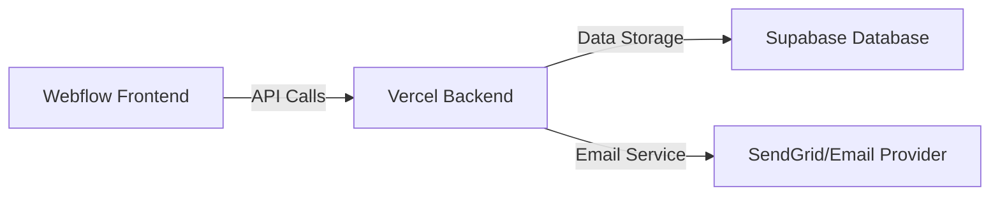

# Complete Waitlist System Setup Guide

A comprehensive guide for setting up a referral-based waitlist system with Vercel (backend), Supabase (database), and Webflow (frontend).

## Table of Contents

- [System Architecture](#system-architecture)
- [Prerequisites](#prerequisites)
- [Supabase Setup](#supabase-setup)
- [Vercel Backend Setup](#vercel-backend-setup)
- [Webflow Integration](#webflow-integration)
- [Testing](#testing)
- [Maintenance](#maintenance)

## System Architecture



## Prerequisites

1. Accounts needed:
   - [Vercel Account](https://vercel.com/signup)
   - [Supabase Account](https://app.supabase.com/sign-up)
   - [GitHub Account](https://github.com/signup)
   - Webflow Account (for frontend)

2. Tools to install:
   - [Node.js](https://nodejs.org/) (v14 or higher)
   - [Git](https://git-scm.com/downloads)
   - [Vercel CLI](https://vercel.com/cli): `npm i -g vercel`
   - [Supabase CLI](https://supabase.com/docs/guides/cli): `npm i -g supabase`

## Supabase Setup

### 1. Create Database

1. Log into [Supabase Dashboard](https://app.supabase.com)
2. Click "New Project"
3. Enter project details:
   - Name: `waitlist-db` (or your preferred name)
   - Database Password: Generate a strong password
   - Region: Choose closest to your users
4. Click "Create Project"

### 2. Create Tables

Run these SQL commands in the Supabase SQL editor:

```sql
-- Create waitlist table
CREATE TABLE waitlist (
    id BIGSERIAL PRIMARY KEY,
    email TEXT UNIQUE NOT NULL,
    referral_code TEXT UNIQUE NOT NULL,
    referred_by TEXT REFERENCES waitlist(referral_code),
    position INTEGER NOT NULL,
    created_at TIMESTAMP WITH TIME ZONE DEFAULT TIMEZONE('utc', NOW()),
    updated_at TIMESTAMP WITH TIME ZONE DEFAULT TIMEZONE('utc', NOW())
);

-- Create referral counts view
CREATE VIEW referral_counts AS
SELECT 
    referral_code,
    COUNT(referred_by) as referral_count
FROM waitlist
WHERE referred_by IS NOT NULL
GROUP BY referral_code;

-- Create function to update timestamps
CREATE OR REPLACE FUNCTION update_updated_at_column()
RETURNS TRIGGER AS $$
BEGIN
    NEW.updated_at = TIMEZONE('utc', NOW());
    RETURN NEW;
END;
$$ language 'plpgsql';

-- Create trigger for timestamp updates
CREATE TRIGGER update_waitlist_updated_at
    BEFORE UPDATE ON waitlist
    FOR EACH ROW
    EXECUTE PROCEDURE update_updated_at_column();
```

### 3. Set up Policies

Add these Row Level Security (RLS) policies:

```sql
-- Enable RLS
ALTER TABLE waitlist ENABLE ROW LEVEL SECURITY;

-- Allow inserts from authenticated service role only
CREATE POLICY "Enable insert for service role only" 
ON waitlist FOR INSERT 
TO authenticated 
WITH CHECK (true);

-- Allow reads for position and referral data
CREATE POLICY "Enable read access for all users"
ON waitlist FOR SELECT
USING (true);
```

### 4. Get Connection Details

1. Go to Project Settings → Database
2. Save these values for later:
   - Connection string
   - Project URL
   - API Key (anon public)
   - JWT Secret

## Vercel Backend Setup

### 1. Create Project Structure

```bash
mkdir waitlist-backend
cd waitlist-backend
npm init -y

# Install dependencies
npm install @supabase/supabase-js cors express nanoid dotenv
npm install --save-dev @types/node @types/express
```

### 2. Create Project Files

Create a new file `.env`:

```env
SUPABASE_URL=your_supabase_project_url
SUPABASE_ANON_KEY=your_supabase_anon_key
SUPABASE_SERVICE_ROLE_KEY=your_supabase_service_role_key
ALLOWED_ORIGINS=https://your-webflow-site.com
```

Create `api/index.js`:

```javascript
const express = require('express');
const cors = require('cors');
const { createClient } = require('@supabase/supabase-js');
const { nanoid } = require('nanoid');
require('dotenv').config();

const app = express();

// Configure Supabase
const supabase = createClient(
  process.env.SUPABASE_URL,
  process.env.SUPABASE_SERVICE_ROLE_KEY
);

// Configure CORS
const corsOptions = {
  origin: process.env.ALLOWED_ORIGINS.split(','),
  methods: ['GET', 'POST', 'OPTIONS'],
  allowedHeaders: ['Content-Type'],
  credentials: true,
};

app.use(cors(corsOptions));
app.use(express.json());

// Join waitlist endpoint
app.post('/api/join', async (req, res) => {
  try {
    const { email, referralCode } = req.body;

    // Validate email
    if (!email || !email.includes('@')) {
      return res.status(400).json({ error: 'Invalid email address' });
    }

    // Check if email already exists
    const { data: existingUser } = await supabase
      .from('waitlist')
      .select('id')
      .eq('email', email)
      .single();

    if (existingUser) {
      return res.status(400).json({ error: 'Email already registered' });
    }

    // Get current position count
    const { data: positionData } = await supabase
      .from('waitlist')
      .select('position')
      .order('position', { ascending: false })
      .limit(1);

    const nextPosition = positionData?.[0]?.position ? positionData[0].position + 1 : 1;

    // Generate unique referral code
    const newReferralCode = nanoid(10);

    // Create new waitlist entry
    const { data: newUser, error } = await supabase
      .from('waitlist')
      .insert([
        {
          email,
          referral_code: newReferralCode,
          referred_by: referralCode || null,
          position: nextPosition,
        },
      ])
      .single();

    if (error) {
      console.error('Database error:', error);
      return res.status(500).json({ error: 'Failed to join waitlist' });
    }

    // Update referrer's position if applicable
    if (referralCode) {
      await updateReferrerPosition(referralCode);
    }

    return res.json({
      position: nextPosition,
      referralCode: newReferralCode,
    });
  } catch (error) {
    console.error('Server error:', error);
    return res.status(500).json({ error: 'Internal server error' });
  }
});

async function updateReferrerPosition(referralCode) {
  // Get referrer's current position and referral count
  const { data: referrer } = await supabase
    .from('waitlist')
    .select('position, referral_code')
    .eq('referral_code', referralCode)
    .single();

  if (!referrer) return;

  // Get count of referrals
  const { data: referralCount } = await supabase
    .from('referral_counts')
    .select('referral_count')
    .eq('referral_code', referralCode)
    .single();

  // Calculate new position based on referrals
  const newPosition = Math.max(1, referrer.position - referralCount.referral_count);

  // Update referrer's position
  await supabase
    .from('waitlist')
    .update({ position: newPosition })
    .eq('referral_code', referralCode);
}

// Health check endpoint
app.get('/api/health', (req, res) => {
  res.json({ status: 'healthy' });
});

module.exports = app;
```

Create `vercel.json`:

```json
{
  "version": 2,
  "builds": [
    {
      "src": "api/index.js",
      "use": "@vercel/node"
    }
  ],
  "routes": [
    {
      "src": "/api/(.*)",
      "dest": "api/index.js"
    }
  ]
}
```

### 3. Deploy to Vercel

1. Push code to GitHub:

```bash
git init
git add .
git commit -m "Initial commit"
git remote add origin your-github-repo-url
git push -u origin main
```

2. Deploy with Vercel:
   - Go to [Vercel Dashboard](https://vercel.com/dashboard)
   - Click "New Project"
   - Import your GitHub repository
   - Add Environment Variables from `.env`
   - Click "Deploy"

3. Configure Domain (optional):
   - Go to Project Settings → Domains
   - Add your custom domain
   - Update DNS records as instructed

## Webflow Integration

[Previous Webflow integration instructions here...]

## Testing

### 1. Test Database Connection

```bash
# Using curl
curl -X GET https://your-vercel-url/api/health
```

### 2. Test Waitlist Signup

```bash
# Test signup
curl -X POST https://your-vercel-url/api/join \
  -H "Content-Type: application/json" \
  -d '{"email":"test@example.com"}'
```

### 3. Test Referral Flow

1. Sign up first user
2. Copy referral code
3. Sign up second user with referral code
4. Verify position updates

## Maintenance

### Regular Tasks

1. Monitor Supabase usage/quotas
2. Check Vercel deployment logs
3. Update dependencies monthly
4. Backup database weekly

### Monitoring

1. Set up Vercel alerts for:
   - Deploy failures
   - High error rates
   - Performance issues

2. Monitor Supabase for:
   - Database size
   - Query performance
   - Connection limits

### Scaling Considerations

1. Add caching for position calculations
2. Implement rate limiting
3. Add queue system for high traffic
4. Set up read replicas if needed

## Troubleshooting

### Common Issues

1. **CORS Errors**
   - Verify ALLOWED_ORIGINS in .env
   - Check Vercel deployment logs
   - Ensure proper headers in requests

2. **Database Connection Issues**
   - Verify Supabase credentials
   - Check IP allow-list
   - Monitor connection pools

3. **Position Calculation Issues**
   - Check referral_counts view
   - Verify trigger functions
   - Monitor transaction logs

For additional support:

- Supabase Discord: [Link]
- Vercel Support: [Link]
- Project Issues: [GitHub Issues Link]

Would you like me to:

1. Add more detailed monitoring setup
2. Include additional deployment configurations
3. Add automated testing examples
4. Include backup and recovery procedures?
